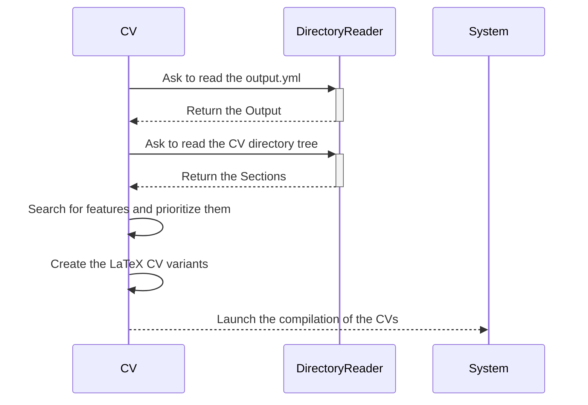
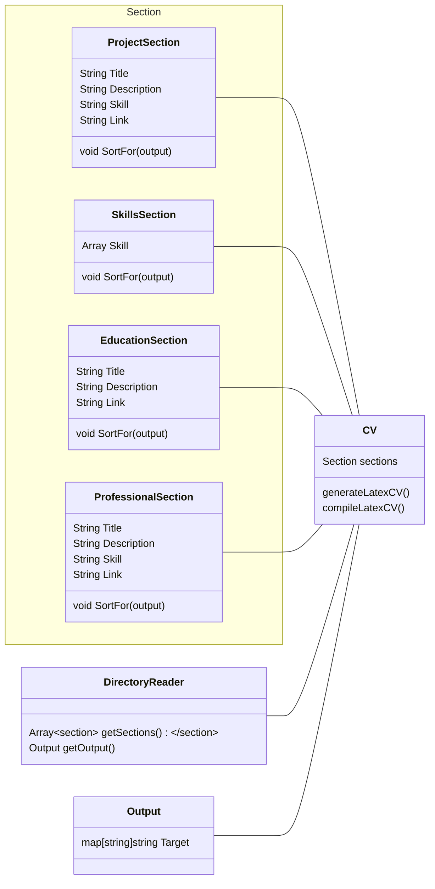

This project is a simple tool written in Go that generates customized CVs from a directory of Markdown files. The CVs are generated based on a provided `output.yml` file, which specifies different skill sets or features (e.g., "foo" or "bar"). The generated CVs are output in LaTeX format and can be compiled locally or using GitHub Actions.

## Project Overview

Given a directory structure containing Markdown files for different sections of a CV (e.g., education, projects, work experience), this tool will:

1. Parse the directory structure and extract relevant sections for both English and French CVs.
2. Use the provided `output.yml` configuration to determine which features or skills to prioritize in different versions of the CV.
3. For each type (e.g., "foo", "bar") specified in `output.yml`, search the corresponding sections for matching lines. These lines will be moved higher in the CV and emphasized (e.g., through formatting) to draw attention to them.
4. Generate CVs for each type specified in the `output.yml`. The number of CVs generated will depend on the number of types defined. For instance, if there are two types (e.g., "foo" and "bar"), four CVs will be generated (Foo in English, Foo in French, Bar in English, Bar in French). If there are more types, the number of CVs will increase accordingly.
5. The generated CVs are first output in LaTeX format, which can then be compiled into a final PDF.

## Example `output.yml`

Below is an example of an `output.yml` configuration file:

```yaml
info:
	name:aNemoN
	first_anem:NoName
	phone_number:+33....
	ect..
foo:
  - FooFeature1
  - FooFeature2
  - FooFeature3

bar:
  - BarFeature1
  - BarFeature2
  - BarFeature3
```

This configuration file indicates that for each "foo" and "bar" type CV, the tool will search the relevant sections for "FooFeature1", "FooFeature2", "FooFeature3" (and similarly for "Bar"). Any line containing these features will be moved higher in the CV and emphasized (e.g., bolded or italicized) in the LaTeX output. The number of CVs generated depends on the number of types (e.g., "foo" and "bar") specified.

## Example Directory Structure

Here’s an example of a canonical directory structure for the CV content:

```
cv/
├── eng
│   ├── education.md
│   ├── project.md
│   └── work.md
└── fr
    ├── education.md
    ├── project.md
    └── work.md
```

The structure includes separate directories for English (`eng`) and French (`fr`) versions of the CV. Each directory contains Markdown files for different sections of the CV, such as `education.md`, `project.md`, and `work.md`.

## Workflow

### Conceptual Flow

The following sequence diagram outlines the process flow of the tool:



### Class Design

The following class diagram illustrates the key components of the system:



## How to Use

1. **Clone the Repository**: Clone this repository to your local machine.
2. **Prepare Your Directory**: Structure your directory with Markdown files as shown in the example above.
3. **Create Your `output.yml`**: Define your CV variations and the features to prioritize in an `output.yml` file.
4. **Run the Tool**: Execute the Golang program to generate LaTeX files, where specified features are prioritized and emphasized.
5. **Compile the LaTeX Files**: Compile the generated LaTeX files to produce your final CV PDFs. This can be done locally or using GitHub Actions.
